  

 

  &nbsp;
  &nbsp;
  &nbsp;
  &nbsp;
  

  

### 👨‍💻 About Me

Full Stack Developer with **2+ years** of professional experience building enterprise platforms, SaaS tools, and production web applications with modern JavaScript ecosystems.

- 💼 &nbsp; Currently at **Groupe Chiali**  building internal DMS and GPAO production systems
- 🏗️ &nbsp; Focus on **clean architecture**, secure API design, and scalable frontend interfaces
- 🎓 &nbsp; B.Sc. Computer Science  Université Djillali Liabes (2020–2023)
- 🌱 &nbsp; Currently deepening expertise in **TypeScript**, **system design**, and **Docker**
- 📬 &nbsp; Open to Full Stack opportunities,remote-friendly
<!-- - 🚀 &nbsp; Running **[Fikrat.tech](https://www.fikrat.tech/)** a digital studio for startups & businesses -->
 

### 🛠️ Tech Stack

**Frontend**

**Backend & Database**

**Tools & DevOps**

### 🚀 Featured Projects

| Project | Description | Stack |
|---|---|---|
| **<a href="https://lazy-query.online" target="_blank">LazyQuery</a>** | Convert SQL/JSON/Prisma schemas into interactive ERD diagrams | React, TypeScript, React Flow, Vite |
| **<a href="https://www.fikrat.tech/" target="_blank">Fikrat.tech</a>** | Digital studio website for startup & business clients | Next.js, TypeScript, Framer Motion |
| **<a href="https://paradisegamedz.com" target="_blank">ParadiseGameDZ</a>** | Digital commerce platform for gaming/streaming subscriptions | Next.js, Supabase, Tailwind |
| **<a href="https://github.com/sarimAbdelbari/Pyramid-Documentary" target="_blank">Pyramid Documentary</a>** | Full-stack CMS for ISO documentation management | React, Node.js, MongoDB |
| **<a href="https://www.vitalife-medical.dz/" target="_blank">VitaLife Medical</a>** | Corporate medical website with responsive design & SEO | Next.js, Tailwind CSS |

### 📊 GitHub Stats

  
  &nbsp;&nbsp;
  

  

  💡 Open to full-stack roles and freelance collaborations <a href="mailto:sarimabdelbari@gmail.com">let's talk</a>

